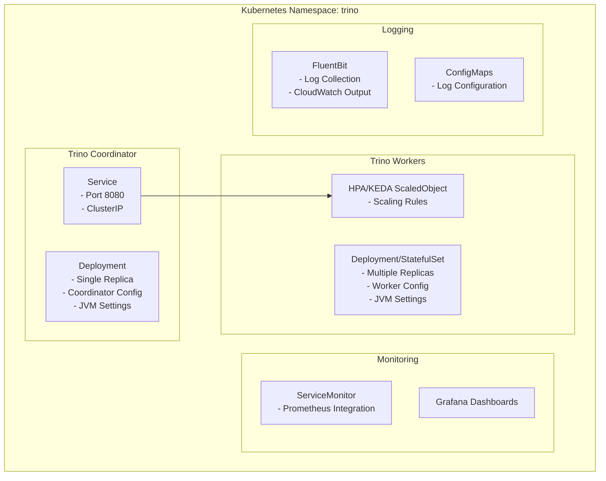
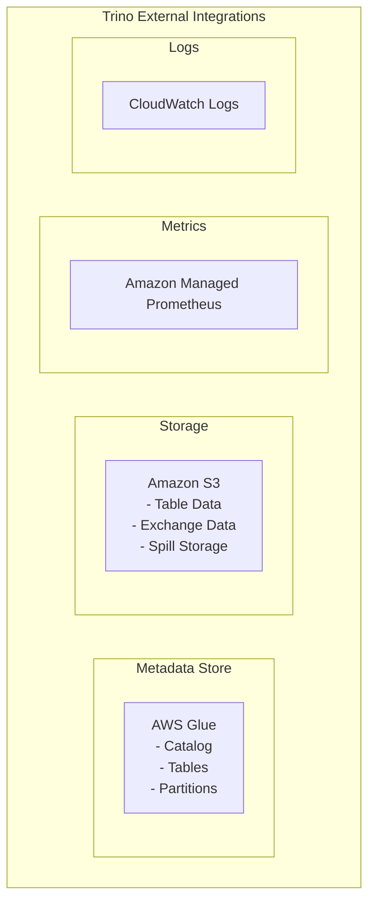
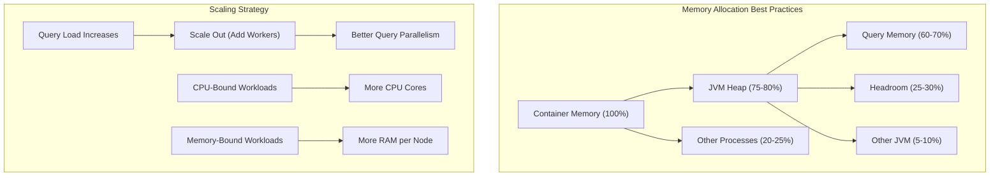

# Trino Helm Configuration

This directory contains Helm chart values and deployment scripts for configuring Trino and related services on Kubernetes.

## Architecture Overview

### Trino Component Architecture


### Integration with AWS Services


## Files Overview

- **trino.yaml**: Main Trino configuration values for the Helm chart, including:
  - Memory configuration for coordinator and worker nodes
  - JVM settings and resource allocations
  - Query settings (max memory, execution time, etc.)
  - Additional configuration properties for performance tuning

- **trino-keda.yaml**: Kubernetes Event-driven Autoscaling (KEDA) configuration for Trino
  - Scales Trino workers based on metrics from Prometheus
  - Defines scaling triggers and metrics thresholds
  - Configures minimum and maximum replica counts

- **kube-prometheus.yaml** and **kube-prometheus-amp-enable.yaml**: 
  - Monitoring configuration for the Trino cluster
  - Amazon Managed Prometheus (AMP) integration settings
  - ServiceMonitor configuration for metrics collection
  - Grafana dashboard definitions

- **metrics-server-values.yaml**: 
  - Configuration for the Kubernetes Metrics Server
  - Resource metrics collection settings
  - API service configuration

- **aws-for-fluentbit-values.yaml**:
  - Log aggregation and management configuration
  - CloudWatch output configuration
  - Filter and parsing rules for logs
  - Buffer and retry settings

## Configuration Parameters

### Key Trino Configuration Parameters

- **Memory Settings**:
  - `coordinator.jvm.maxHeapSize`: Coordinator node heap size
    - Default: "2G" for development (should be larger for production)
    - Recommendation: 75% of allocated container memory
  
  - `worker.jvm.maxHeapSize`: Worker node heap size
    - Default: "2G" for development (70-80% of container memory in production)
    - For production: Should be sized based on query complexity
  
  - `coordinator/worker.config.query.maxMemoryPerNode`: Per-node query memory allocation
    - Default: "1.4GB" (approximately 70% of JVM heap)
    - Production recommendation: 60-70% of heap size

- **Resource Allocation**:
  - `coordinator/worker.resources.requests/limits`: CPU and memory allocations
    - Coordinator minimum: 2 CPU cores, 4GB memory for production
    - Worker minimum: 4 CPU cores, 16GB memory for production workloads
    - Memory limits should be ~25% higher than requests

- **Query Settings**:
  - `server.config.query.maxMemory`: Maximum memory per query
    - Default: "4GB" for development environment
    - Production: Scale based on dataset size and complexity
  
  - `server.config.query.maxExecutionTime`: Maximum query execution time
    - Default: "1h" prevents runaway queries
    - Can be adjusted based on workload patterns
  
  - `additionalConfigProperties`: Performance tuning parameters
    - `retry-policy`: Configure query retry behavior
    - `exchange.compression-enabled`: Enable/disable compression for data exchange
    - `spill-enabled`: Allow spilling to disk for memory-intensive operations
    - `memory.heap-headroom-per-node`: Reserve memory for JVM operations

### Advanced Configuration

- **Exchange Manager**:
  - `server.exchangeManager.name`: Type of exchange manager to use
    - "filesystem" for local storage (development)
    - "s3" for production with S3 backing
  
  - `server.exchangeManager.baseDir`: Base directory for exchange files
    - For S3: URI format "s3://{bucket-name}/trino-exchange"
    - For filesystem: Local path like "/tmp/trino-exchange"

- **Catalog Configuration**:
  - `additionalCatalogs`: Defines data sources
    - Memory catalog for testing
    - Hive catalog for AWS Glue/S3 integration
    - Iceberg catalog for table format support
    - Custom catalogs for specific data sources

### Scaling and Deployment

- `server.workers`: Initial worker count (static configuration)
  - Start with 2-3 for smaller workloads
  - Can be overridden by autoscaling

- `server.autoscaling.enabled`: Enable/disable autoscaling
  - When true, uses Kubernetes HPA
  - When using KEDA, can be false as KEDA manages scaling

- KEDA ScaledObject configuration:
  - `minReplicaCount`: Minimum number of worker replicas
  - `maxReplicaCount`: Maximum number of worker replicas
  - `pollingInterval`: How frequently to check metrics
  - `cooldownPeriod`: Time before scaling down after load reduces
  - `triggers`: Metric-based scaling rules

### Performance Tuning Guidelines



- **General Guidelines**:
  - Coordinator needs less CPU but stable memory
  - Workers need more CPU and memory proportional to workload
  - Scale out (more workers) rather than up (larger workers) for better parallelism

- **Memory Allocation Rules**:
  - JVM heap: 75-80% of container memory
  - Query memory: 60-70% of JVM heap
  - Headroom: 25-30% of JVM heap

- **CPU Allocation**:
  - Coordinator: 2-4 cores typically sufficient
  - Workers: 4-16 cores depending on query complexity
  - CPU:Memory ratio typically 1:4 or 1:8 GB for analytics workloads

## Usage

To deploy Trino and related services:
```bash
./helm/_deploy.sh
```

To clean up deployed resources:
```bash
./helm/_cleanup.sh
```

## Troubleshooting

- Check pod logs for JVM errors and out-of-memory issues
- Monitor worker scaling events through KEDA
- Verify connectivity between Trino and AWS Glue/S3
- Check ServiceMonitor for metrics collection issues 