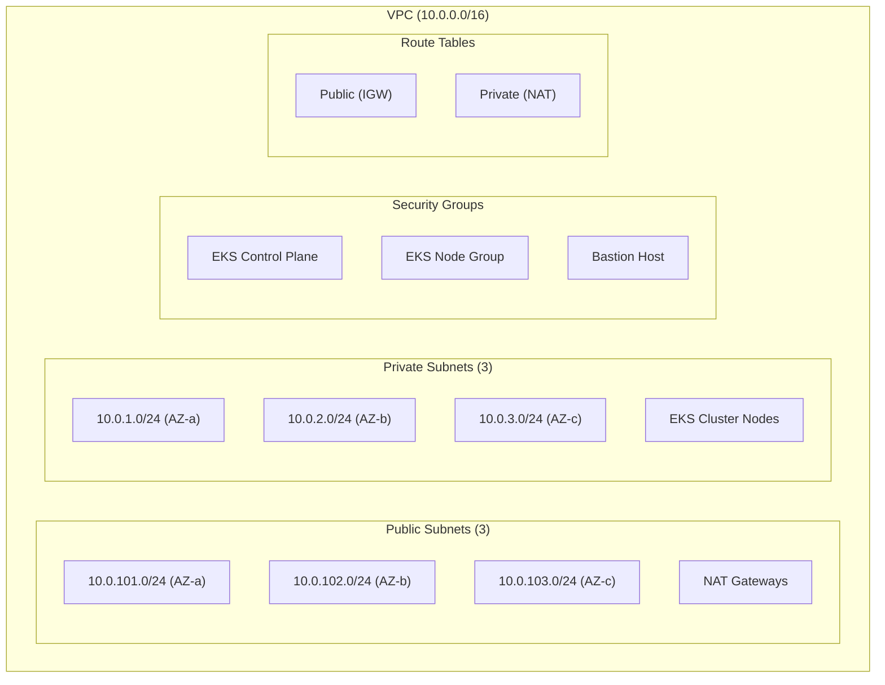
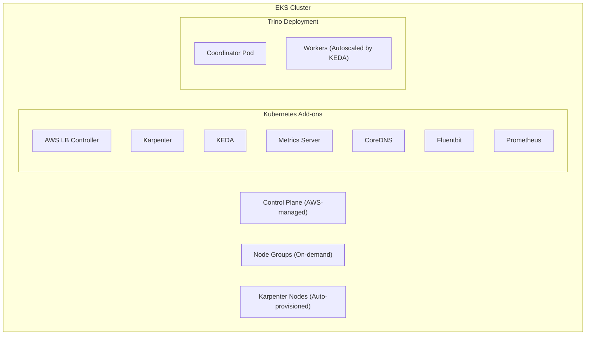
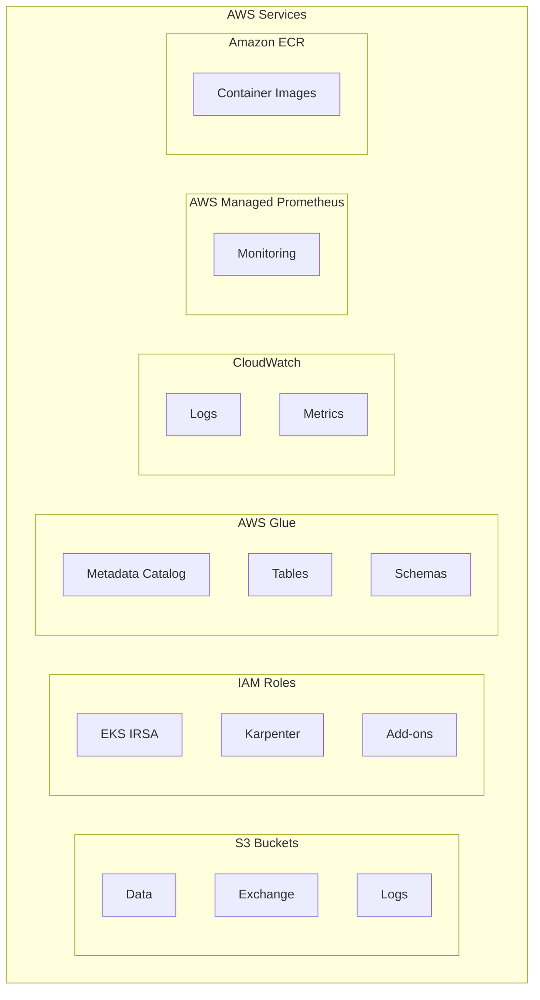
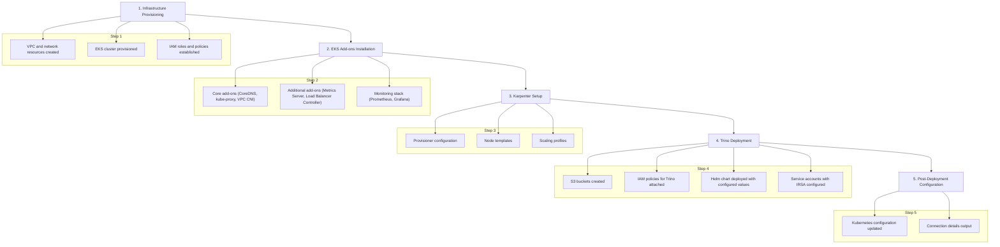
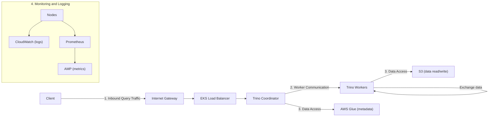

# Trino Terraform Deployment

This directory contains Terraform configurations for deploying Trino on Amazon EKS (Elastic Kubernetes Service).

## Architecture Overview

The deployment follows a multi-tier architecture with the following components:

### Network Architecture


### EKS and Trino Components


### AWS Service Integration


## Infrastructure Components

The Terraform configuration creates the following resources:

- **EKS Cluster**: 
  - Managed Kubernetes cluster on AWS (v1.28)
  - Control plane managed by AWS
  - Worker nodes run in private subnets
  - API server endpoints can be private or public

- **VPC and Networking**: 
  - Dedicated VPC with public and private subnets
  - 3 Availability Zones for high availability
  - NAT Gateways for outbound internet access from private subnets
  - Security groups for controlling traffic flow
  - Network ACLs for subnet-level security

- **S3 Buckets**: 
  - Data bucket for Trino (stores table data)
  - Exchange bucket for Trino's exchange manager (facilitates query distribution)
  - Event logs bucket (captures operational logs)
  - All buckets configured with server-side encryption (AES-256)
  - Lifecycle policies for cost optimization

- **IAM Roles and Policies**: 
  - EKS IRSA (IAM Roles for Service Accounts) for fine-grained permissions
  - Policies for S3 access (read/write)
  - Glue catalog access permissions
  - Least privilege principle enforced

- **Karpenter**: 
  - Kubernetes node autoscaler for dynamic scaling
  - Provisions nodes based on pod resource requirements
  - Supports multiple instance types
  - Consolidation for cost optimization

- **Kubernetes Add-ons**: 
  - AWS Load Balancer Controller for managing ALBs/NLBs
  - Metrics Server for resource metrics
  - CoreDNS for DNS resolution
  - Prometheus for monitoring
  - Fluentbit for log collection
  - KEDA for pod-based autoscaling

## Deployment Workflow

The deployment process follows this sequence:



## Network Traffic Flow

The network traffic flows as follows:



## Key Files

- **main.tf**: Main Terraform configuration file that sets up providers and locals
- **variables.tf**: Variable definitions for the Terraform configuration
- **trino.tf**: Trino-specific resources including S3 buckets and IAM policies
- **eks.tf**: EKS cluster configuration
- **karpenter.tf**: Node autoscaler configuration
- **addons.tf**: Kubernetes add-ons configuration
- **vpc.tf**: Networking configuration
- **outputs.tf**: Output variables from the Terraform deployment
- **versions.tf**: Terraform and provider version constraints

## Detailed Configuration Parameters

### Network Configuration

- `vpc_cidr`: CIDR block for the VPC (default: 10.0.0.0/16)
- `private_subnets`: List of private subnet CIDRs (default: 10.0.1.0/24, 10.0.2.0/24, 10.0.3.0/24)
- `public_subnets`: List of public subnet CIDRs (default: 10.0.101.0/24, 10.0.102.0/24, 10.0.103.0/24)
- `azs`: List of availability zones to use (varies by region)
- `enable_nat_gateway`: Enables NAT gateways for private subnets
- `single_nat_gateway`: Whether to use a single NAT gateway for all private subnets

### EKS Configuration

- `cluster_name`: Name of the EKS cluster
- `cluster_version`: Kubernetes version (default: 1.28)
- `cluster_endpoint_public_access`: Whether the API server is publicly accessible
- `cluster_endpoint_private_access`: Whether the API server is accessible from within the VPC

### Node Configuration

- `instance_types`: EC2 instance types for worker nodes (default: m5.large, m5a.large, m5n.large)
- `capacity_type`: Type of capacity to use (ON_DEMAND or SPOT)
- `min_size`: Minimum number of nodes (default: 3)
- `max_size`: Maximum number of nodes (default: 10)
- `desired_size`: Initial desired number of nodes (default: 3)

### Karpenter Configuration

- `karpenter_instance_types`: List of EC2 instance types Karpenter can provision
- `karpenter_capacity_type`: Type of capacity Karpenter should use (ON_DEMAND or SPOT)
- `karpenter_ttl_seconds_after_empty`: Time to live for empty nodes

### Trino Configuration

- S3 bucket configurations for data storage and exchange management
- IAM roles and policies for AWS Glue and S3 access
- Helm chart values for Trino deployment
- KEDA scaling configuration

## Security Considerations

- All worker nodes run in private subnets
- IAM roles follow the principle of least privilege
- S3 buckets are encrypted with SSE
- Network security groups restrict traffic flow
- Kubernetes RBAC enforced for API access
- Service accounts use IRSA for AWS resource access

## Usage

### Prerequisites

- AWS CLI configured with appropriate permissions
- Terraform installed (version specified in versions.tf)
- kubectl installed

### Deployment

To deploy the infrastructure:

```bash
./_install.sh
```

This script will:
1. Initialize Terraform
2. Apply the Terraform configuration
3. Configure kubectl to communicate with the EKS cluster

### Cleanup

To destroy all created resources:

```bash
./_cleanup.sh
```

## Resource Customization

To customize the deployment, you can modify:

- **variables.tf**: Change default values or provide a tfvars file
- **trino.tf**: Adjust S3 bucket configurations and IAM policies
- **helm-values/trino.yaml**: Modify Trino configuration parameters

## Output Values

After deployment, the following outputs are available:

- `configure_kubectl`: Command to configure kubectl to access the EKS cluster
- `cluster_endpoint`: The EKS cluster endpoint
- `data_bucket`: The name of the S3 bucket for Trino data storage 